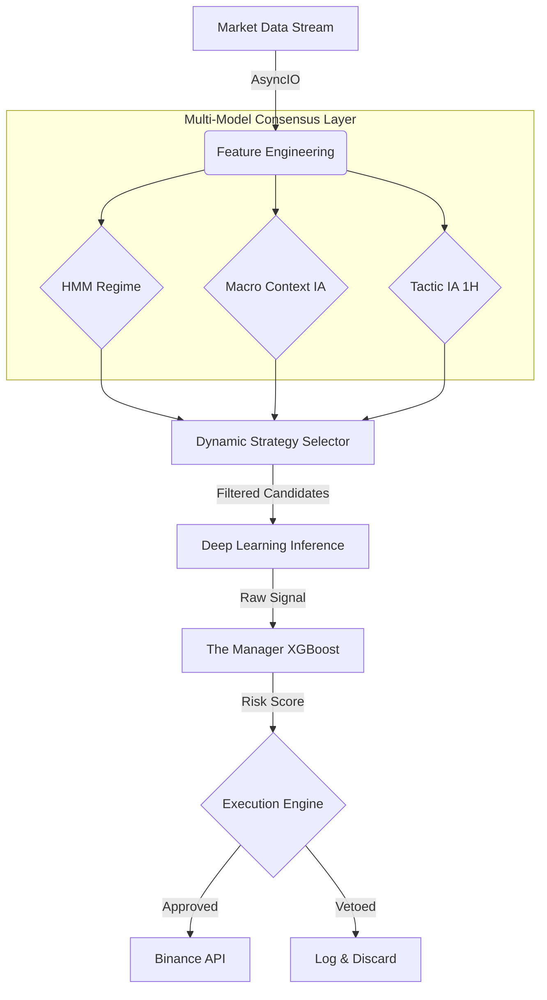

# 🌌 Stellarium AI: Advanced Quantitative Trading System


**Stellarium AI** is an autonomous, high-frequency algorithmic trading engine designed for cryptocurrency futures markets. It implements a **Hybrid AI Architecture** that combines Unsupervised Learning (HMM) for market regime detection, Deep Learning for pattern recognition, and Gradient Boosting (XGBoost) for trade quality assurance.

> **Key Differentiator:** Unlike standard bots, Stellarium features a "Manager" meta-model that vets every trade signal against historical probabilities, dynamically adjusting leverage based on confidence levels.

## 🏗️ System Architecture

The system follows a modular microservices-like architecture within a containerized environment:



🧠 Core Components

Market Context (HMM): Uses hmmlearn to classify market conditions into latent states (e.g., Low Volatility Bull, High Volatility Crash).

Signal Generators (TensorFlow): A suite of Neural Networks trained on specific strategies (Trend Following, Mean Reversion, Breakout).

The Manager (Meta-Model): A secondary ML layer that predicts the probability of a signal's success. It acts as a risk filter, reducing false positives.

Predictive Audit: A backtesting module that continually validates the model's predictive power against fresh data.

📂 Repository Structure

This repository is organized into the full Machine Learning lifecycle:
```
SUBIDA/
├── main.py                  # Production Orchestrator
├── requirements.txt         # Dependencies
├── Dockerfile               # Container Configuration
├── .gitignore               # Security Rules
│
├── MODULOS/                 # Core Logic & Helpers
├── ESTRATEGIAS/             # Technical Indicators
│
├── training/                # AI Lab (Data Mining & Training)
│   ├── train_manager_model.py
│   ├── train_neural_nets.py
│   ├── hmm_analysis.py
│   └── data_miner.py
│
├── backtesting/             # Validation Engines
│   ├── backtest_engine.py
│   └── audit_predictive_power.py
│
└── IA_FINAL_CHECKS/         # System Integrity & Calibration
    ├── check_hmm.py             # Hidden Markov Model Validator
    └── hyper_calibration_matrix.py # Hyperparameter Tuning
```
🚀 Key Features

Fault Tolerance: Implements a JSON-based state recovery system (Crash Recovery). The bot can restart after a server failure without losing track of open positions.

Real-Time Command & Control: Full integration with Telegram API for remote monitoring, manual overrides, and "Panic Mode" (Kill Switch).

Dynamic Risk Management:

Auto-Fuse: Stops trading if daily drawdown exceeds 5%.

Volatility Guard: Automatically pauses trading during extreme anomalies detected by the HMM.

Smart Sizing: Position size is calculated based on volatility (ATR) and AI confidence.

🛠️ Setup & Installation
Prerequisites: Docker & Docker Compose (Recommended) or Python 3.10+.

1. Clone the Repo
```
Bash
git clone [https://github.com/xdutk/trading-ia-engine.git](https://github.com/xdutk/trading-ia-engine.git)
cd trading-ia-engine
```
2. Environment Configuration

Create a .env file in the root directory (not included in repo for security):

```
BINANCE_API_KEY=your_key
BINANCE_SECRET_KEY=your_secret
TELEGRAM_TOKEN=your_token
TELEGRAM_CHAT_ID=your_id
```
3. Build & Run with Docker
```
Bash
docker build -t stellarium-bot .
docker run -d --env-file .env --name stellarium-v1 stellarium-bot
```
⚠️ Disclaimer & Usage

Models: Pre-trained binary models (.keras, .pkl) are excluded from this repository to protect IP and reduce size. Use the scripts in training/ to generate your own models.

Educational Use: This software is for educational and portfolio demonstration purposes. Trading cryptocurrency futures involves significant risk.

Author: Xavier Dutka

Python Developer | AI & Quantitative Trading Enthusiast
